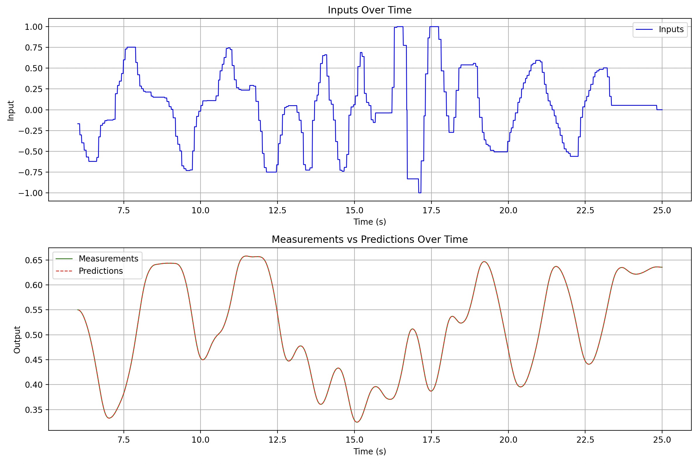
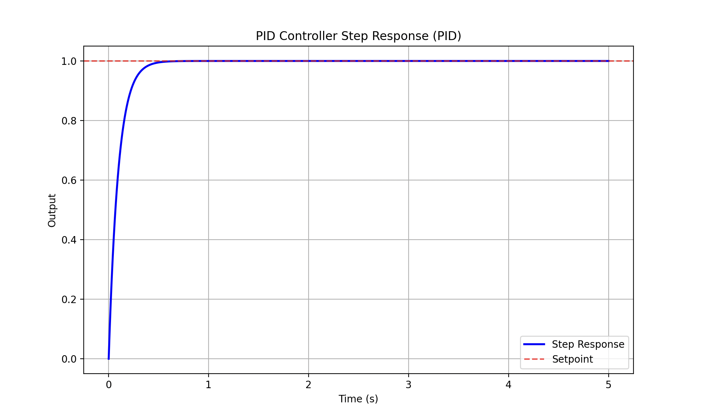

# System Identification with ARX

Python scripts for identifying a system from data and tuning a PID controller.

Based on the first chapter of [System Identification: Theory for the User by Ljung](./doc/SystemIdentificationLjung.pdf)

## Installation

Install dependencies:

```
./install.sh
```

## System Identification

Identify a system from a dataset: [System Identification Script](./system-identification.py)

```
./system-identification.py
```

Parameters at the top of the script:

|Parameter|Description|
|-|-|
|`dataset`|Which CSV dataset to use: `time`, `input`, `measurement`|
|`start`|Start time in seconds for samples to select|
|`end`|End time in seconds for samples to select|
|`smoothingFactor`|Gaussian filtering amount or `0` to disable|
|`numberOfStates`|How many states to estimate (i.e. 2 states = 2nd order model with position and velocity)
|`numberOfInputs`|How many inputs to estimate|
|`delayTimeSteps`|How many time steps are measurements delayed from inputs|

Example output:

```
State transition parameters: [-1.96399484  0.96400979]
Input parameters: [1.37622864e-04 2.55175613e-05 4.77652206e-05]
Mean Squared Error: 0.0000%, Fit: 100.00%
```



## PID Controller Tuning

Tune a PID controller: [Tuning Script](./tune.py)

```
./tune.py
```

Parameters at the top of the script:

|Parameter|Description|
|-|-|
|`controllerType`|`P`, `PI`, `PID`, `PD`, `PIV`|
|`responsiveness`|Balance between speed and precision, (0 Slower...1 Faster)|
|`transientBehavior`|Balance between aggressiveness and neatness, (0 Aggressive...1 Robust)|

Example output:

```
PID Tuning

Responsiveness: 0.5 (0=Slower, 1=Faster)
Transient Behavior: 0.5 (0=Aggressive, 1=Robust)
Time Step: 0.01 seconds

Transfer Function:

       0.000138s² + 0.000026s + 0.000048
G(s) = ─────────────────────────────────
       s² + -1.963995s + 0.964010


PID Gains:

Continuous Gains:
Kp = 0.3001
Ki = 1.1000
Kd = 10.0000

Discrete Gains:
Kp = 0.3001
Ki = 0.0055
Kd = 2000.0000

Rise Time: 0.015 seconds
Settling Time: 0.370 seconds
Overshoot: 0.0%
```

